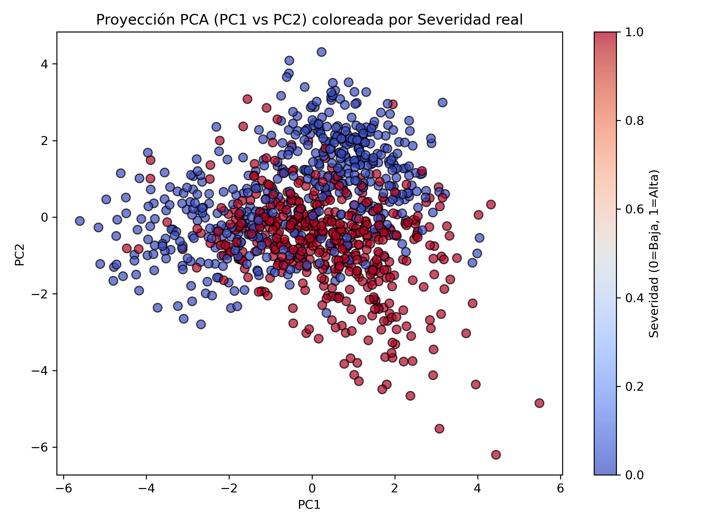
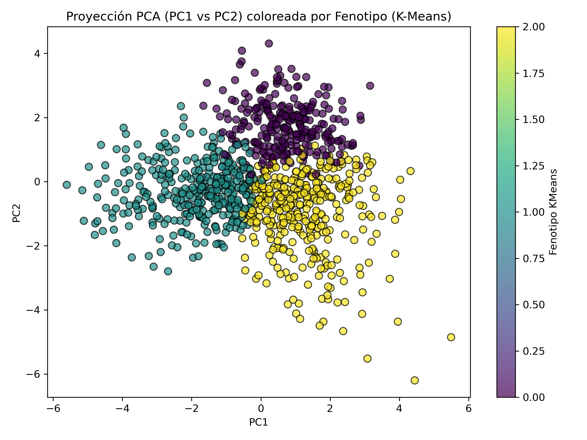
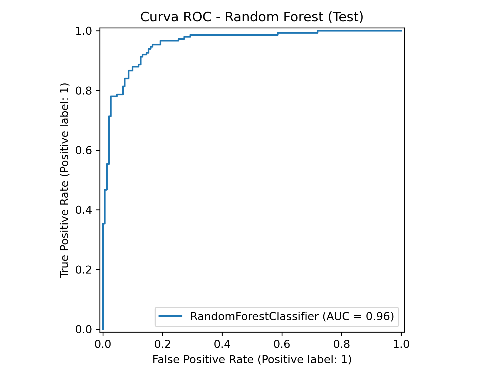

# Tarea4
Se realizará la tarea según las indicaciones

# Proyecto Integrador – Fenotipado y Predicción de Severidad

Este proyecto simula un escenario clínico donde se sospecha que un síndrome crónico complejo presenta **fenotipos** que podrían responder distinto al tratamiento.  
El objetivo es integrar:

- Validación 
- Modelos complejos 
- Métodos no supervisados 

El análisis se realizó con Python en Jupyter Notebook (`fenotipado_y_prediccion.ipynb`).

---

# 1. Preparación del Dataset y Fenotipado

Se simuló un dataset con:
- **15 biomarcadores/síntomas (X1–X15)**
- **Outcome binario:**  
  - 0 = Severidad baja  
  - 1 = Severidad alta  

Se aplicó:

1. **StandardScaler**  
2. **PCA (2 componentes)**
3. **K-Means (n=3)** como método de fenotipado no supervisado.

### ➤ Varianza explicada por PCA:

- PC1: **0.209**
- PC2: **0.145**
- Total PC1+PC2: **35.4%**

Esto significa que el plano PC1–PC2 captura parte relevante de la estructura del síndrome, pero no toda. Es útil para visualizar, no para reemplazar las 15 variables originales.

### PCA coloreado por Severidad

Se observa solapamiento considerable: la severidad no forma dos nubes completamente separadas → clínicamente realista.

### PCA coloreado por Fenotipo (K-Means)

Aquí se observan **tres grupos definidos** que representan posibles fenotipos biológicos.  
Esto permite una mejor estratificación que el outcome binario.

### 🔬 Implicaciones en un ensayo clínico:

- Permite **estratificar la aleatorización** por fenotipo.
- Permite evaluar si la respuesta al tratamiento **cambia entre fenotipos** (interacción tratamiento × fenotipo).
- Facilita avanzar hacia **medicina personalizada**.

---

# 2. Predicción de Severidad (Modelo Supervisado)

Se construyó un modelo **Random Forest** usando:

- Las 15 features
- El fenotipo descubierto por K-Means

Se usó **split 70/30** para Train/Test.

### ➤ Resultado principal:  
**AUC final en test = 0.958**

Esto representa una capacidad predictiva excelente para identificar precocemente pacientes con severidad alta.

---

# 3. Reflexión: Random Forest vs MLP (Redes Neuronales)

Aun cuando el **Random Forest** obtuvo un AUC más alto en este dataset tabular, el uso de **redes neuronales** sigue siendo fundamental en salud por:

1. **Capacidad para manejar datos no tabulares:**  
   - Imágenes médicas (RX, TAC, RM)  
   - Texto clínico (epicrisis, notas de urgencia)  
   - Señales (ECG, Pletismografía, EEG)

2. **Arquitecturas multimodales:**  
   Integran laboratorio + imagen + texto → algo imposible con modelos de árboles.

3. **Aprendizaje de representaciones complejas:**  
   MLP y redes profundas permiten capturar patrones no lineales de alta dimensionalidad en big data clínico.

Por ello, incluso si RF gana en AUC, las redes neuronales siguen siendo herramientas esenciales en proyectos de salud complejos.

---

# 4. Consideración Ética

Si una de las features estuviera altamente correlacionada con **nivel socioeconómico (NSE)**, podría inducir **sesgo algorítmico**:

- El modelo podría etiquetar pacientes de NSE bajo como “mayor severidad” de forma injusta.  
- Esto podría perpetuar inequidades en acceso o priorización clínica.

**Como bioestadística, antes de desplegar el modelo debería:**

1. **Auditar la feature sensible**  
   - Importancia de variables, SHAP, desempeño por subgrupos.

2. **Considerar excluirla** si no aporta significativamente al rendimiento.

3. **Documentar y supervisar** el impacto del modelo sobre la equidad en salud.

El objetivo no es solo maximizar AUC, sino garantizar justicia y no discriminación.

---

# 5. Conclusión Ejecutiva

> El análisis permitió avanzar desde la regresión logística tradicional hacia un enfoque moderno de **fenotipado y predicción con modelos de ensamblaje**. Mediante PCA y K-Means se identificaron tres fenotipos clínicos dentro del síndrome, lo que abre oportunidades para una estratificación más eficiente y la planificación de ensayos personalizados. Al incorporar el fenotipo en un modelo de Random Forest se obtuvo un AUC de **0.958**, demostrando alta capacidad discriminativa para detección temprana de severidad. Este enfoque integra visión poblacional, medicina personalizada y validación rigurosa, manteniendo siempre consideraciones éticas en torno a sesgo algorítmico y uso responsable de IA en salud.

---
